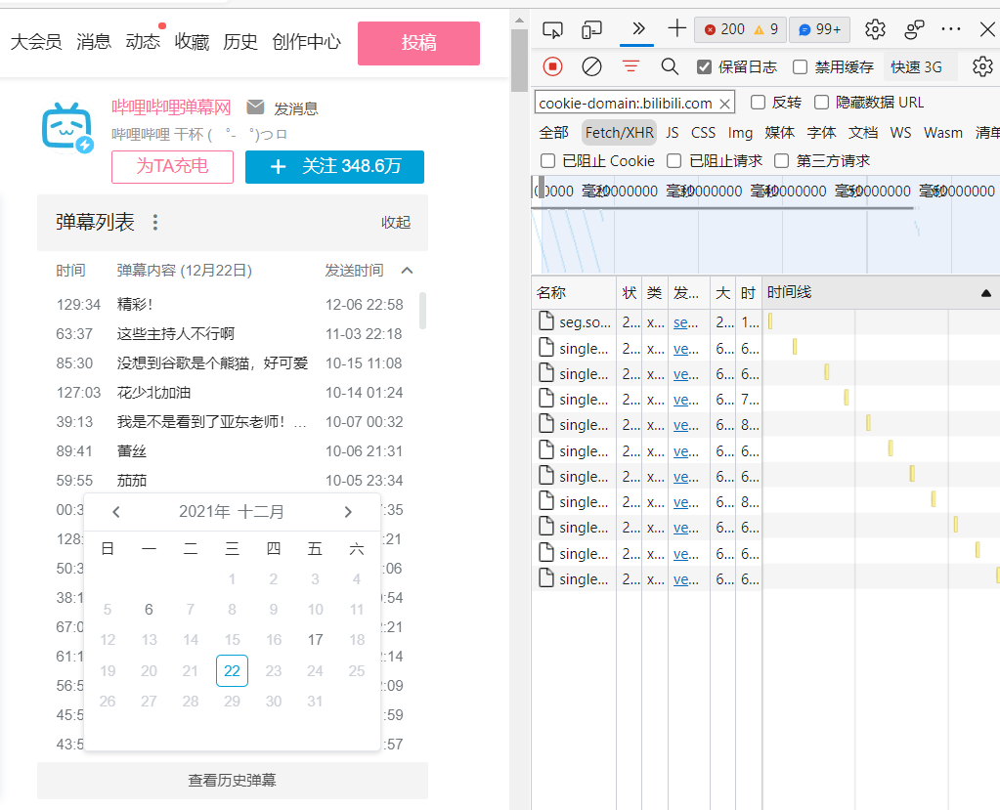
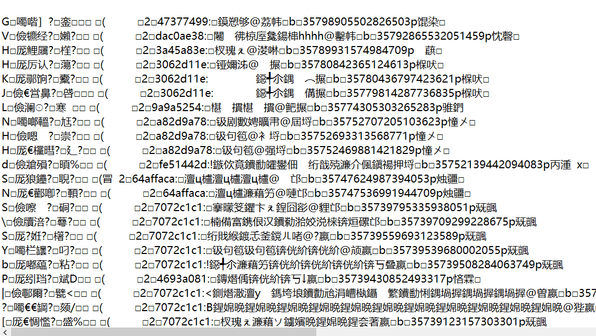
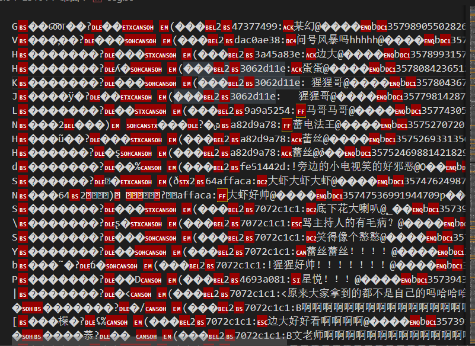

# 代码是利用requests库按日期爬取B站的历史弹幕

## 一. 查看B站历史弹幕，同时进行抓包

   <!-- 按ctrl+alt+v粘贴图片-->  

找到这个url连接:`https://api.bilibili.com/x/v2/dm/web/history/seg.so?type=1&oid=73717870&date=2021-12-22`

## 二. 打开该链接下载了如下seg.so文件，打开发现是乱码，改成utf8编码，发现弹幕部分不再是乱码，但其他信息仍然是乱码，说明文件经过了加密

观察到弹幕前面是一个`:`开始，`@`结尾。
可利用正则表达式匹配。

## 三. 编写代码，需要注意的是headers中需要加入cookie，否则B站不让登录

## 四. 有时间再找一下B站的没有加密的接口

可参考网址：
<https://github.com/fython/BilibiliAPIDocs>  
<https://blog.csdn.net/weixin_47190827/article/details/113177411>
